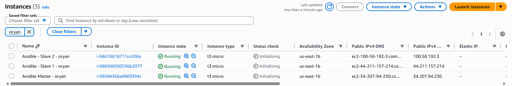

# AWS Infrastructure Automation with Ansible & Nginx (Part 1)


Automated provisioning, connectivity setup, and dynamic configuration of Nginx web servers across AWS EC2 instances using **Ansible** playbooks and **Jinja2** templating.

---

## 📌 Project Overview

This project (Part 1) establishes a centralized infrastructure automation pipeline on AWS. Using a dedicated Control Node (`Main`), target managed nodes (`slave1` and `slave2`) are automatically configured with Nginx, system dependencies, and custom web content injected with live server metadata.

---

## 🏗️ AWS EC2 Architecture & Topology

The deployment environment consists of three `t3.micro` EC2 instances running Ubuntu within the `us-east-1b` Availability Zone:

| Instance Name | AWS Instance ID | Public IPv4 Address | Role | System Profile |
| :--- | :--- | :--- | :--- | :--- |
| **Ansible Master - oryan** | `i-09584366a0809394c` | `34.207.94.230` | Control Node (`Main`) | Ubuntu 22.04 LTS / Ansible |
| **Ansible - Slave 1 - oryan** | `i-098500500536b2077` | `44.211.157.214` | Target Node (`slave1`) | Ubuntu 22.04 LTS / Nginx |
| **Ansible - Slave 2 - oryan** | `i-0467d618711cc438a` | `100.58.192.3` | Target Node (`slave2`) | Ubuntu 22.04 LTS / Nginx |

### Security Group Configuration
- **Port 22 (SSH):** Inbound traffic allowed for administrative access and agentless Ansible orchestration.
- **Port 80 (HTTP):** Inbound traffic enabled to serve Web application traffic publicly.



---

## 📂 Directory & File Structure

```text
part1-ansible-nginx-setup/
├── inventory/
│   └── hosts               # Managed nodes inventory definition
├── templates/
│   └── index.html.j2       # Jinja2 dynamic HTML web template
├── images/                 # Project documentation images
├── site.yml                # Main Ansible provisioning playbook
└── README.md               # Project documentation
## 🧪 Verification & Execution Flow

### 1. Connectivity Verification (`ping` module)
Before running the playbook, end-to-end SSH key authentication and Python environment readiness were verified using Ansible's ad-hoc ping module against all target nodes:

```bash
ansible slaves -m ping
```

