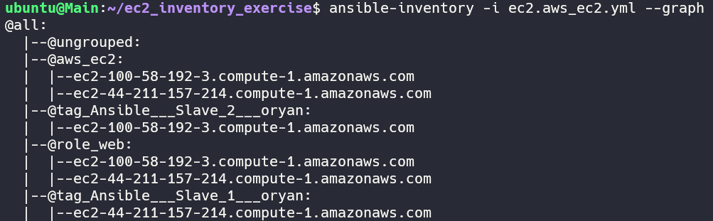
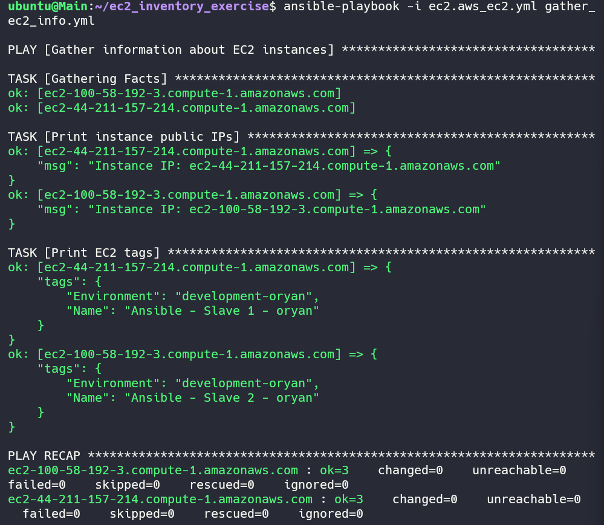
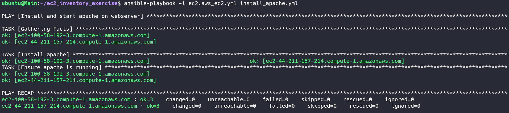
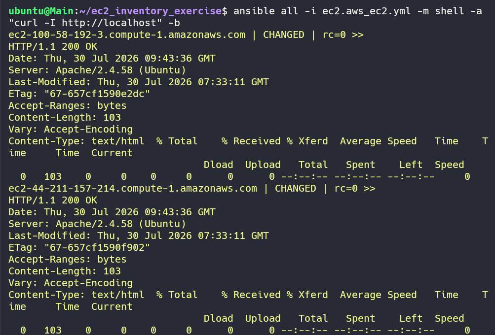

# AWS EC2 Infrastructure Automation & Web Server Deployment

Automated dynamic node discovery and Apache web server deployment across AWS EC2 instances using Ansible, Python `boto3`, and the `amazon.aws.aws_ec2` inventory plugin.

---

## 📌 Project Overview

This repository provides an automated infrastructure management workflow designed to inspect and manage dynamic AWS EC2 instances without hardcoding IP addresses. 

### Key Capabilities
* **Dynamic Node Discovery:** Uses `amazon.aws.aws_ec2` inventory plugin to query AWS API real-time for instance states, public/private IPs, and tags.
* **EC2 Metadata Inspection:** Includes a dedicated playbook (`gather_ec2_info.yml`) to collect and report instance parameters, network configurations, and facts.
* **Idempotent Web Deployment:** Deploys and manages Apache HTTP servers (`install_apache.yml`), automatically resolving service conflicts (e.g., competing processes bound to port 80).
* **Cluster Verification:** Validates service status across target nodes via Ansible ad-hoc executions.

---

## 📁 Repository Structure

```text
.
├── ec2.aws_ec2.yml       # AWS EC2 Dynamic Inventory plugin configuration
├── gather_ec2_info.yml   # Playbook to collect dynamic metadata & EC2 facts
├── install_apache.yml    # Playbook for installing, configuring, and starting Apache
├── ansible.cfg           # Ansible environment configuration settings
├── images                # Contains all the images
├── .gitignore            # Security filtering (excludes *.pem keys and AWS credentials)
└── README.md             # Project documentation
```

---

## 🛠️ Prerequisites & Setup

Ensure the **Control Node** meets the following dependencies:

1. **Python Dependencies:**
   ```bash
   sudo apt update
   sudo apt install -y python3-pip python3-venv
   pip install ansible boto3 botocore
   ```

2. **Ansible Collection:**
   ```bash
   ansible-galaxy collection install amazon.aws
   ```

3. **AWS Authentication:**
   Configure active AWS credentials (via AWS CLI, environment variables, or IAM Instance Profile):
   ```bash
   aws configure
   ```

---

## 🚀 Workflows & Execution

### Step 1: Dynamic Inventory Verification
Verify that the `aws_ec2` plugin successfully queries AWS and retrieves active instances:
```bash
ansible-inventory -i ec2.aws_ec2.yml --graph
```


### Step 2: Gather EC2 Metadata & Facts
Run the inspection playbook to collect instance details across the inventory:
```bash
ansible-playbook -i ec2.aws_ec2.yml gather_ec2_info.yml
```


### Step 3: Deploy Apache Web Server
Execute the deployment playbook across all discovered instances:
```bash
ansible-playbook -i ec2.aws_ec2.yml install_apache.yml
```


### Step 4: Post-Deployment Cluster Verification
Run an ad-hoc command from the Control Node to verify HTTP response status from target nodes:
```bash
ansible all -i ec2.aws_ec2.yml -m shell -a "curl -I http://localhost" -b
```



---

## 🔍 Engineering Deep Dive: Troubleshooting & Failure Recovery

During the initial execution of `install_apache.yml`, the `Ensure apache is running` task failed on target nodes (`Slave1`, `Slave2`).

### 1. Root Cause Identification
Executing an Ansible ad-hoc diagnostic command against system logs revealed socket binding failure:
```bash
ansible all -i ec2.aws_ec2.yml -m command -a "journalctl -xeu apache2.service -n 20 --no-pager" -b
```

**Error output:**
```text
(98)Address already in use: AH00072: make_sock: could not bind to address 0.0.0.0:80
(98)Address already in use: AH00072: make_sock: could not bind to address [::]:80
no listening sockets available, shutting down
```
* **Analysis:** Port 80 was occupied by a competing daemon (Nginx / orphaned process), preventing Apache from binding to socket `0.0.0.0:80`.

### 2. Resolution & Idempotency Fix
To ensure the playbook operates idempotently across any execution state, a task was added to preemptively stop competing web services before triggering the Apache service:

```yaml
- name: Ensure competing service (nginx) is stopped
  ansible.builtin.service:
    name: nginx
    state: stopped
  ignore_errors: true

- name: Install apache
  ansible.builtin.apt:
    name: apache2
    state: present
    update_cache: true

- name: Ensure apache is running and enabled
  ansible.builtin.service:
    name: apache2
    state: started
    enabled: true
```

---

## 🔐 Security Standards
* **Credential Isolation:** `.gitignore` strictly prevents pushing RSA private keys (`*.pem`), SSH keys, and local AWS profile caches to Git repositories.
* **Privilege Escalation:** Task execution utilizes explicit root privilege escalation (`become: true`) scoped only to required tasks.
