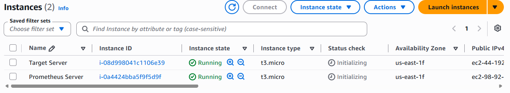
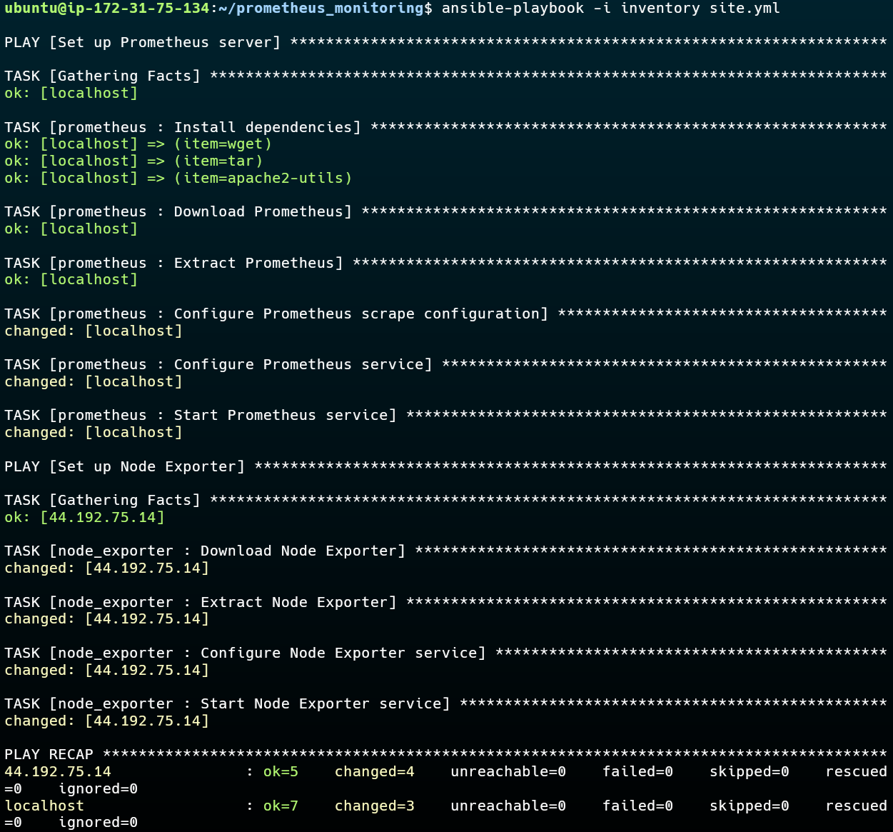
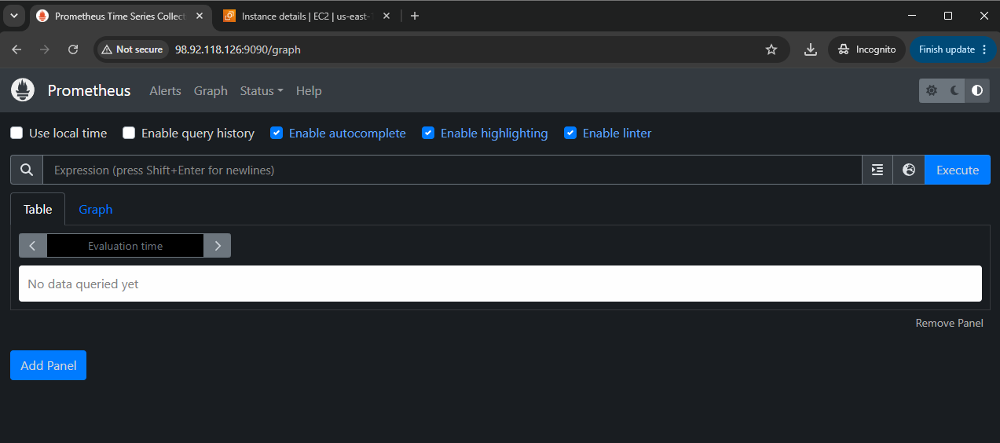
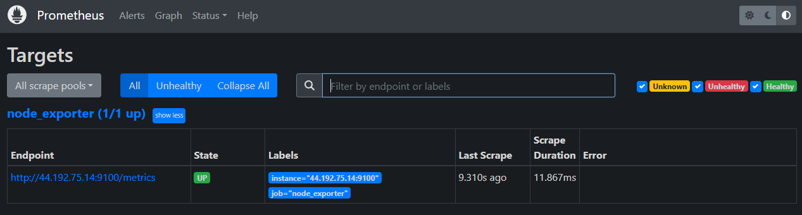
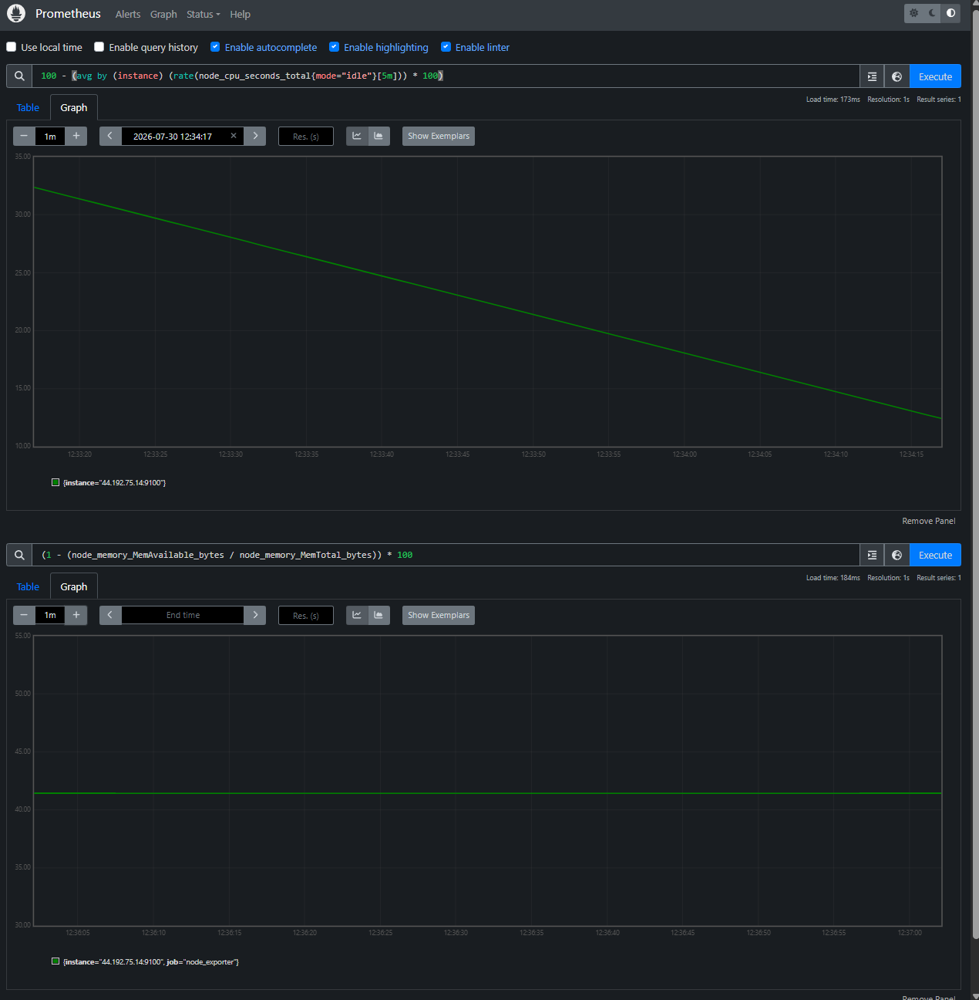

# Automated Prometheus & Node Exporter Deployment via Ansible

A production-grade DevOps implementation demonstrating automated system monitoring deployment on AWS EC2 using Ansible Roles, Jinja2 dynamic templating, and Systemd service management.

---

## 📐 Architecture & Design Principles

The project utilizes a 2-node AWS EC2 topology running Ubuntu 22.04 LTS:

```text
+-------------------------------------------------------+               +----------------------------------+
|               Prometheus EC2 Instance                 |               |        Target EC2 Instance       |
|  (Acts as Ansible Control Node & Monitoring Server)   |               |         (Monitored Host)         |
|                                                       |               |                                  |
|  +--------------------+    +-----------------------+  |               |  +----------------------------+  |
|  |  Ansible Engine    |    |   Prometheus Server   |  |  SSH (22)     |  |   Node Exporter Service    |  |
|  |  (Local Execution) |--->|   (Port 9090)         |=================>|   (Port 9100)              |  |
|  +--------------------+    +-----------------------+  | Pull Metrics  |  +----------------------------+  |
+-------------------------------------------------------+               +----------------------------------+
```

### Key Engineering Decisions
* **Co-located Control Node:** The Ansible engine is deployed directly on the Prometheus server, executing local tasks (`ansible_connection=local`) for self-setup and remote SSH execution for target nodes.
* **Key-Based Authentication:** Secured passwordless SSH access established via 4096-bit RSA key pairs between the Control Node and managed hosts.
* **Dynamic Target Discovery:** The Prometheus scrape configuration (`prometheus.yml.j2`) uses Jinja2 loops to dynamically render target targets directly from the Ansible `inventory`.
* **Modular Role Architecture:** Separation of concerns into distinct Ansible Roles (`prometheus` and `node_exporter`) for maintainability and scalability.

---

## 🏗️ Repository Hierarchy

```text
prometheus_monitoring/
├── inventory                   # Inventory mapping (localhost + targets)
├── images                      # Images used
├── site.yml                    # Main orchestration playbook
├── group_vars/                 # Directory for group-level variables
└── roles/
    ├── prometheus/             # Prometheus Server Deployment Role
    │   ├── tasks/              # Task definitions (installation, configuration, service)
    │   └── templates/          # Jinja2 templates (prometheus.yml, systemd unit)
    └── node_exporter/          # Node Exporter Deployment Role
        ├── tasks/              # Task definitions (binary setup, systemd management)
        └── templates/          # Jinja2 template for node_exporter systemd unit
```

---

## ⚙️ Prerequisites & Setup

1. **Infrastructure:**
   - 2x AWS EC2 Instances (Ubuntu 22.04 LTS).
   - **Security Groups:** 
     - Port `22` (SSH) — Administrative access.
     - Port `9090` (Prometheus Web UI) — Inbound allowed on Monitoring host.
     - Port `9100` (Node Exporter) — Inbound allowed from Prometheus Server.



2. **SSH Key Exchange:**
   Generate keypair on the Control Node and append the public key to the target host's `authorized_keys`:
   ```bash
   ssh-keygen -t rsa -b 4096 -N "" -f ~/.ssh/id_rsa
   ssh-copy-id ubuntu@44.192.75.14
   ```

---

## 🚀 Quick Start & Usage

### 1. Configure Inventory
Update the `inventory` file with your managed target server details:

```ini
[prometheus]
localhost ansible_connection=local

[targets]
44.192.75.14 ansible_user=ubuntu
```

### 2. Execute Deployment
Run the main orchestration playbook:

```bash
ansible-playbook -i inventory site.yml
```


---

## 🛠️ Roles Overview

* **`prometheus` Role:**
  * Installs core dependencies (`wget`, `tar`, `apache2-utils`).
  * Downloads and extracts Prometheus binary (v2.44.0).
  * Dynamically renders `prometheus.yml` using Jinja2 target interpolation.
  * Provisions and manages the `prometheus.service` Systemd daemon.

* **`node_exporter` Role:**
  * Fetches and unpacks Node Exporter (v1.6.1).
  * Provisions `node_exporter.service` Systemd unit.
  * Starts and enables the exporter daemon listening on port 9100.

---

## 📊 Verification & PromQL Metrics Validation

1. Access Prometheus UI at `http://98.92.118.126:9090`.



2. Navigate to **Status -> Targets** and confirm `44.192.75.14:9100` state is **UP**.

### Verified PromQL Queries
* **Target Reachability:**
  ```promql
  up
  ```

  
* **Real-Time CPU Usage (%):**
  ```promql
  100 - (avg by (instance) (rate(node_cpu_seconds_total{mode="idle"}[5m])) * 100)
  ```
* **Memory Utilization (%):**
  ```promql
  (1 - (node_memory_MemAvailable_bytes / node_memory_MemTotal_bytes)) * 100
  ```

